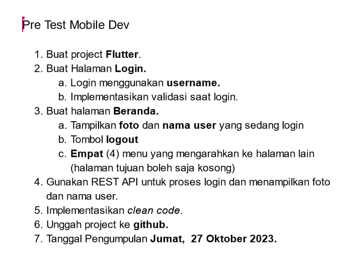
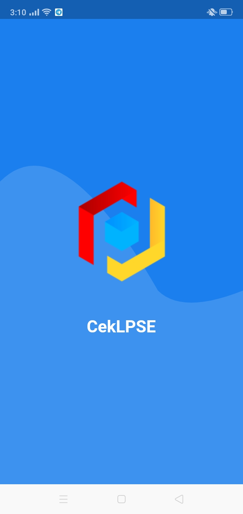
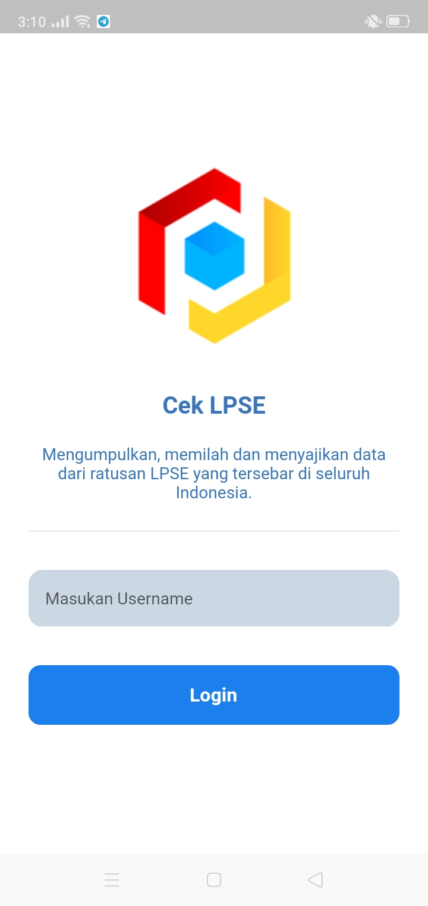
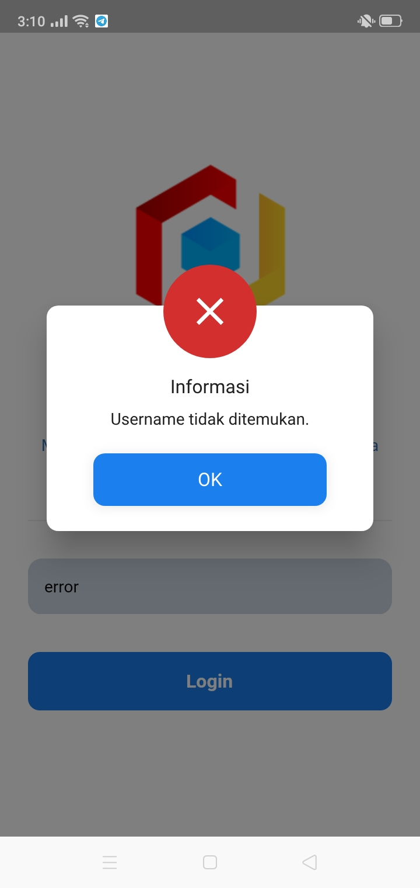
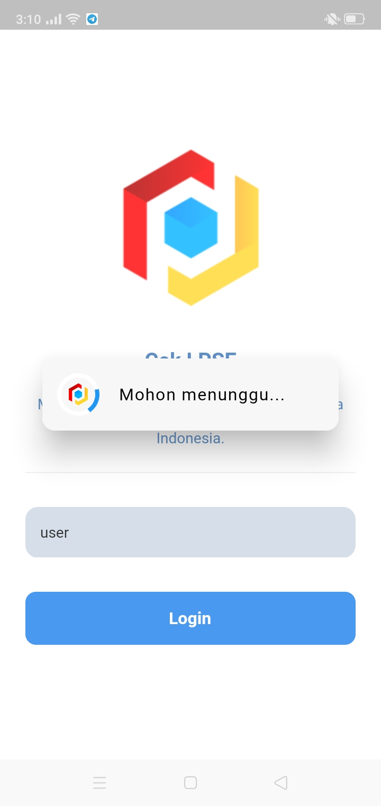
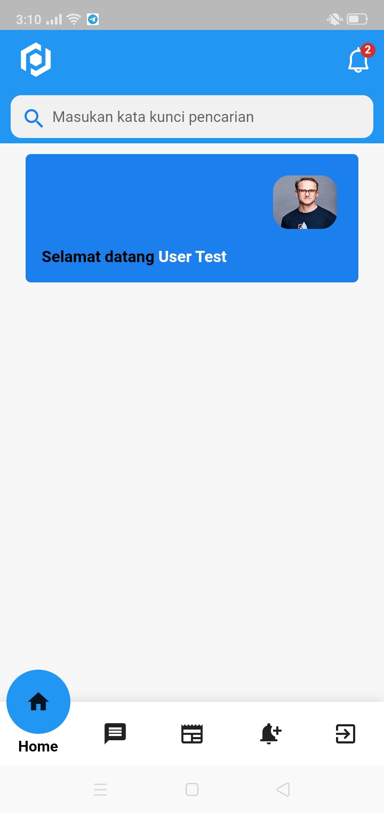
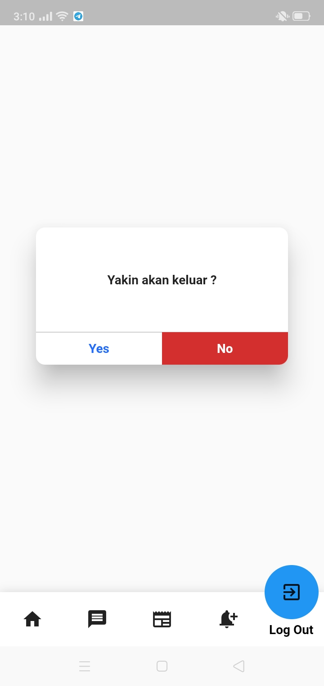

# Pre Test Mobile Dev

CekLPSE Mobile Dev

## Dokumentasi
  - Untuk demo gunakan username : user
  - API Menggunakan CI3
  - DATABASE POSTGRESQL

Task :

Progress :

##Splash

  

##Login

  

##Err. Validation

##Login Process

##Dashboard

##Logout

